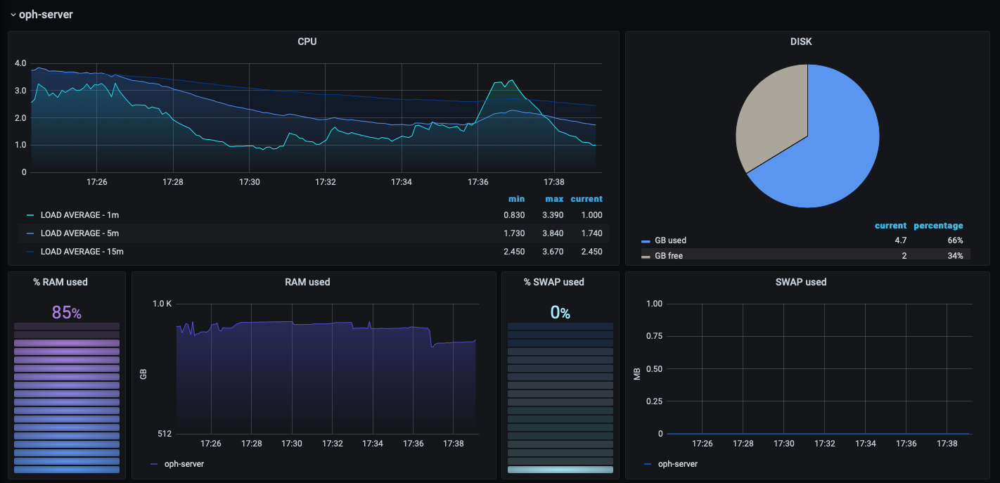
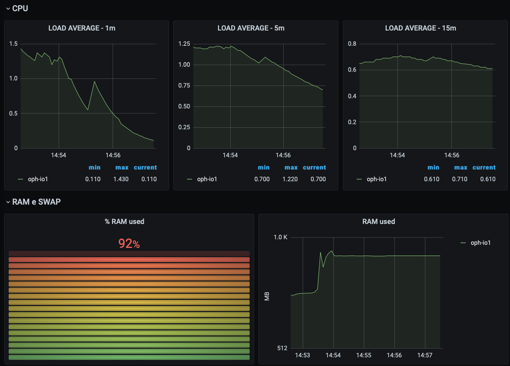
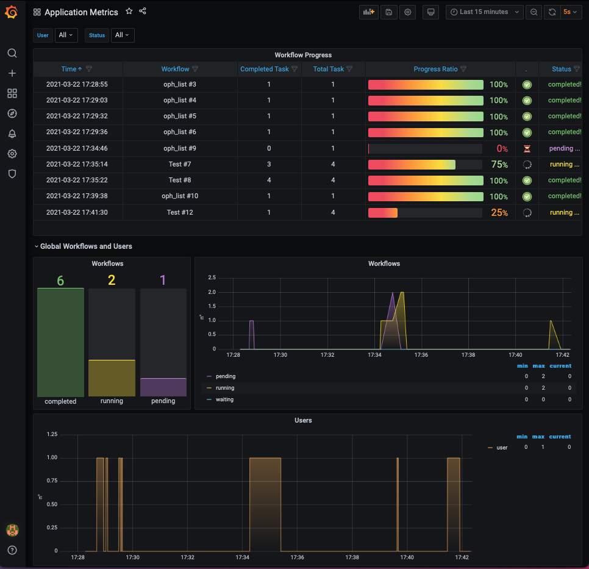

ECAS monitoring
=
This repository hosts the main files used as templates by the Ophidia Ansible role (https://github.com/OphidiaBigData/ansible-role-ophidia-cluster) during the playbook execution as well as the tasks to install and configure the **ECAS monitoring system**, which exploits **Grafana** and the underlying **InfluxDB** database to monitor the ECAS cluster both at system and application level in the context of the elastic deployment of ECAS on the EGI FedCloud through the EC3 LToS service.

Grafana dashboard JSON codes
------------------
The ECAS monitoring system consists of two dashboards, which have been adapted with respect to the ECASLab versions in order to reflect the elastic behavior of the cluster in terms of number of active working node instances.
* **Infrastructure_Metrics.json.**: it provides information about the percentage of CPU, RAM, SWAP and disk used on each node (the front-end and the working nodes);   

<table>
<tr>
<td></td>
<td></td>
</tr>
</table>

* **Application_Metrics.json.**: it shows information about which operator/workflow is being executed and its current execution status and provides aggregated information over time (e.g. number of total, completed and failed workflows/tasks, hourly weighted average of running cores).

Monitoring scripts
------------------
Two monitoring scripts are used to collect metrics over time and store the corresponding values in the underlying *InfluxDB* database:
* **infrastructure_monitor_user.sh.**: the script is executed on each cluster node (front-end and working nodes) in order to retrieve several infrastructural information like:
	* the CPU and I/O utilization of the last one, five, and 15 minute periods;
	* the amount of total/used/available disk space;
	* the total amount of the physical and  swap memory, as well as the free and used memory.
* **server_monitor.sh.**: the script, executed only on the front-end node, writes data (related to users as well as workflows and tasks status) logged by the Ophidia server (<code>/usr/local/ophidia/oph-server/log/monitor.log</code>) into InfluxDB using the InfluxDB 2.0 API. 

Note
------------------
1. In the <code>server_install.yml</code> and <code>io_install_yml </code> YAML files are reported only the tasks to install Grafana and InfluxDB and to configure the whole monitoring system (database setup and user creation, data sources and dashboards import, monitoring scrips execution). The complete versions of the YAML files are available under the  Ophidia Ansible role repository (https://github.com/OphidiaBigData/ansible-role-ophidia-cluster).
2. The <code>influxdb_cred.j2</code> template is used to store the credentials (password and token) randomly generated for the <code>admin</code>  and <code>ecas</code>  InfluxDB users. This information will be stored in the <code>influxdb_cred</code> file located under the <code>/root/.influxdbv2/</code>  directory.
 Similarly, the random password generated for the Grafana <code>admin</code> user will be stored in the  <code>.grafana_pwd</code> file located under the root folder.
